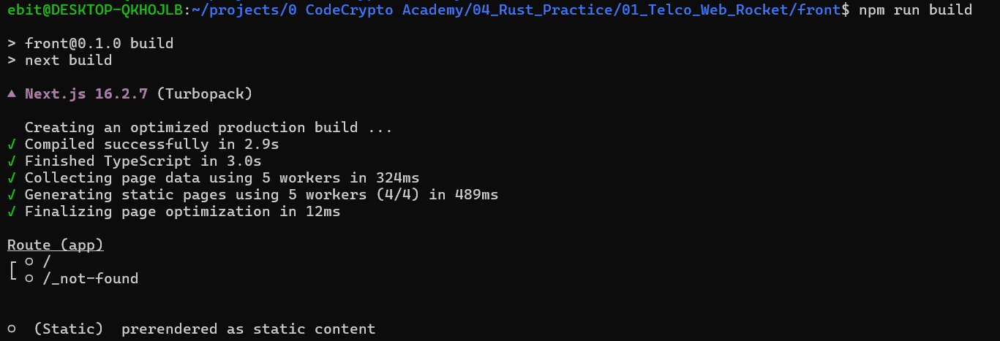
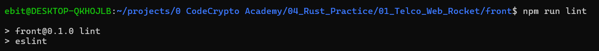
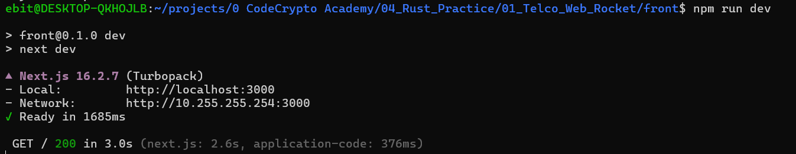
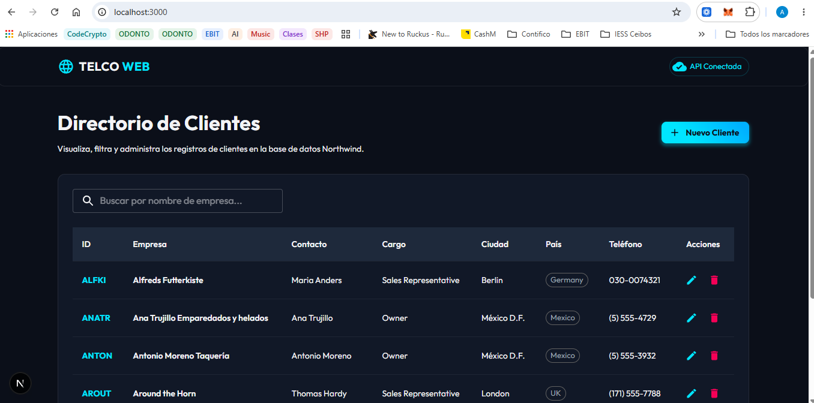
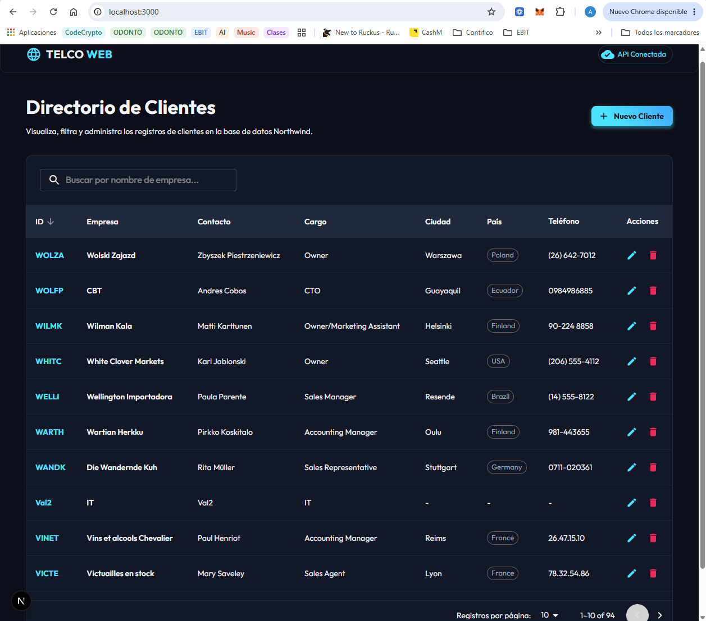
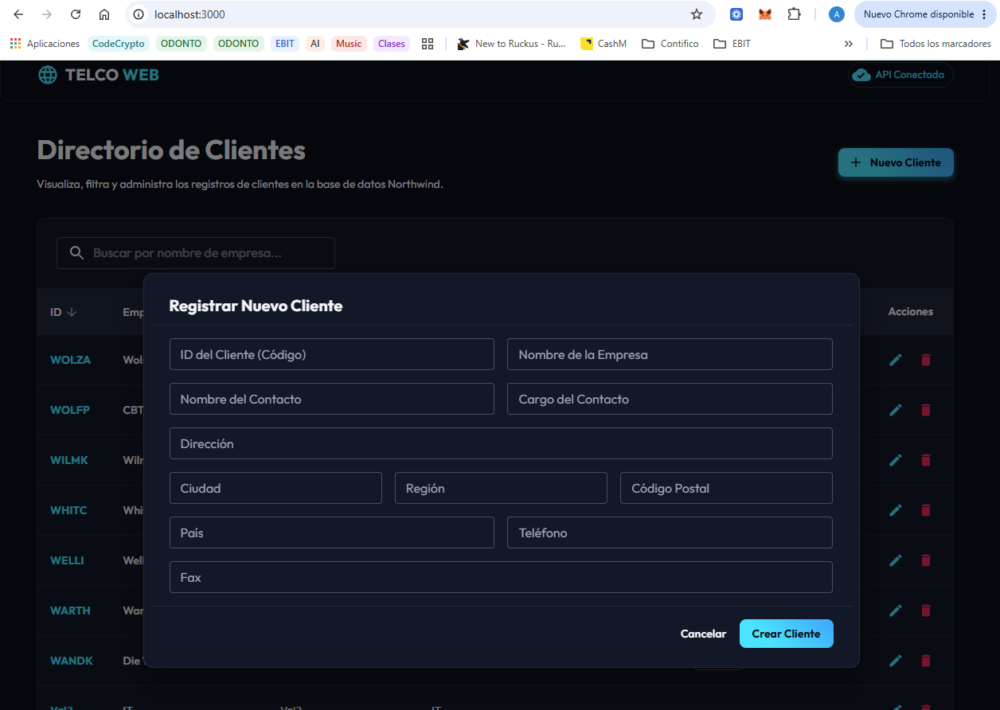
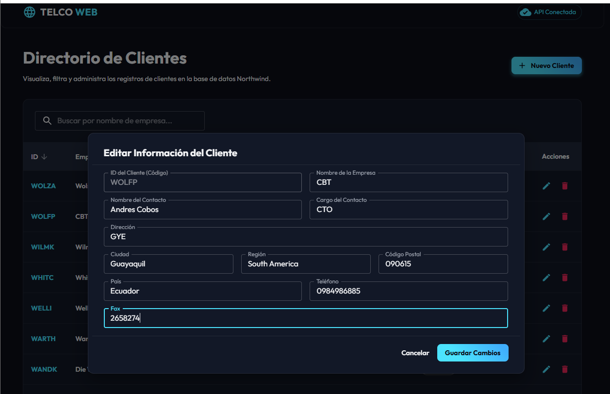
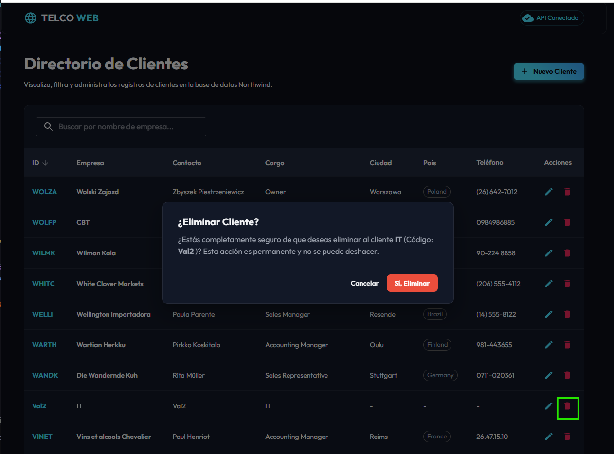

# Telco Customer Management - Full-Stack App

Este proyecto es una aplicación web full-stack premium para la gestión y administración del directorio de clientes de la base de datos Northwind. Está compuesto por un backend API RESTful de alto rendimiento en **Rust (Rocket)** y una interfaz de usuario interactiva y responsiva en **Next.js (TypeScript & Material-UI)**.

---

## 📂 Estructura del Workspace

```text
01_Telco_Web_Rocket/
├── README.md               # Guía general de configuración y documentación del proyecto
├── rocket-junio/           # Backend (API REST en Rust con Rocket)
│   ├── src/main.rs         # Servidor principal, lógica de base de datos y endpoints
│   ├── Cargo.toml          # Dependencias de Rust (Rocket, Serde, Rusqlite)
│   ├── northwind.db        # Base de datos SQLite (Ignorada en Git)
│   └── test.http           # Suite de pruebas HTTP para el backend
└── front/                  # Frontend (Next.js, TypeScript y Material-UI)
    ├── src/app/            # Páginas, layout y configuración de temas
    ├── package.json        # Dependencias de npm (MUI, React Hook Form)
    └── tsconfig.json       # Configuración de TypeScript
```

---

## 🚀 Guía de Instalación y Montaje desde Cero

### Requisitos Previos
*   **Rust & Cargo:** Instalar desde [rustup.rs](https://rustup.rs/)
*   **Node.js & npm:** Instalar desde [nodejs.org](https://nodejs.org/) (Versión recomendada LTS)

---

### Paso 1: Configurar y Levantar el Backend (Rust)

1. Navega al directorio del backend:
   ```bash
   cd rocket-junio
   ```
2. **Importante:** Asegúrate de colocar el archivo de base de datos `northwind.db` en la raíz de esta carpeta (`rocket-junio/`).
3. Levanta el servidor de desarrollo:
   ```bash
   cargo run
   ```
   *El backend estará disponible en: [http://localhost:8001](http://localhost:8001)*

---

### Paso 2: Configurar y Levantar el Frontend (Next.js)

1. Abre otra terminal y navega al directorio del frontend:
   ```bash
   cd front
   ```
2. Instala los paquetes y dependencias de npm:
   ```bash
   npm install
   ```
3. Inicia el servidor de desarrollo:
   ```bash
   npm run dev
   ```
   *El frontend estará disponible en: [http://localhost:3000](http://localhost:3000)*

---

## 🛠️ Detalle de las Etapas de Desarrollo

### 🔹 Etapa 1: Infraestructura y Conexión de Base de Datos
*   **Objetivo:** Configuración inicial, conexión segura a la base de datos y verificación de salud.
*   **Comandos y Dependencias:**
    *   `rusqlite = { version = "0.31", features = ["bundled"] }` - Integra SQLite de forma estática para evitar requerir librerías C del sistema.
*   **Archivos Relacionados:**
    *   [`rocket-junio/src/main.rs`](file:///home/ebit/projects/0%20CodeCrypto%20Academy/04_Rust_Practice/01_Telco_Web_Rocket/rocket-junio/src/main.rs): Estructura `DbState` con `Mutex<Connection>` para acceso seguro entre hilos, inicialización de la base de datos y endpoint de comprobación `/health`.
*   **Pruebas:**
    *   Petición `GET /health` que retorna el conteo real de registros de clientes (93 clientes) y estado saludable de la conexión.

### 🔹 Etapa 2: Endpoints CRUD y Middleware de CORS
*   **Objetivo:** Desarrollar los endpoints CRUD para la tabla `Customers` y habilitar peticiones cross-origin.
*   **Archivos Relacionados:**
    *   [`rocket-junio/src/main.rs`](file:///home/ebit/projects/0%20CodeCrypto%20Academy/04_Rust_Practice/01_Telco_Web_Rocket/rocket-junio/src/main.rs): Fairing `Cors` personalizado, manejador global de solicitudes `OPTIONS` preflight, y rutas CRUD completas:
        *   `GET /customers`: Listado con soporte para paginación (`page`, `per_page`), búsqueda LIKE (`name_filter`), y ordenamiento dinámico seguro (`sort_field`, `sort_order`).
        *   `GET /customers/<id>`: Detalles de un cliente individual.
        *   `POST /customers`: Creación de cliente (con validación de campos obligatorios e IDs únicos).
        *   `PUT /customers/<id>`: Actualización de datos.
        *   `DELETE /customers/<id>`: Eliminación de cliente.
    *   [`rocket-junio/test.http`](file:///home/ebit/projects/0%20CodeCrypto%20Academy/04_Rust_Practice/01_Telco_Web_Rocket/rocket-junio/test.http): Archivo con 11 peticiones secuenciales automatizadas para probar todas las operaciones del API.

### 🔹 Etapa 3: Estructura del Frontend y Maquetación Visual (MUI)
*   **Objetivo:** Inicializar el frontend con Next.js y TypeScript, maquetar la interfaz gráfica y aplicar diseño premium.
*   **Comandos y Dependencias:**
    *   `npx -y create-next-app@latest ./front --ts --eslint --app --src-dir --import-alias "@/*" --use-npm --disable-git --yes`
    *   `npm install @mui/material @emotion/react @emotion/styled @mui/icons-material react-hook-form`
*   **Archivos Relacionados:**
    *   [`front/src/app/layout.tsx`](file:///home/ebit/projects/0%20CodeCrypto%20Academy/04_Rust_Practice/01_Telco_Web_Rocket/front/src/app/layout.tsx): Integración de la fuente **Outfit** de Google Fonts.
    *   [`front/src/app/theme.tsx`](file:///home/ebit/projects/0%20CodeCrypto%20Academy/04_Rust_Practice/01_Telco_Web_Rocket/front/src/app/theme.tsx): Registro del tema oscuro premium de Material-UI.
    *   [`front/src/app/page.tsx`](file:///home/ebit/projects/0%20CodeCrypto%20Academy/04_Rust_Practice/01_Telco_Web_Rocket/front/src/app/page.tsx): Maquetación estática responsiva de la tabla de clientes, barra superior e inputs de búsqueda.
*   **Pruebas Realizadas en esta Etapa:**
    1.  **Prueba de Compilación (`npm run build`):** Valida la ausencia de errores en TypeScript y la correcta generación de páginas estáticas del compilador de Next.js.
        
        
        
    2.  **Prueba de Linter (`npm run lint`):** Garantiza que no existan advertencias de estilos o buenas prácticas en el código de React.
        
        
        
    3.  **Prueba de Renderizado y Visualización Local (`npm run dev`):** Levanta el servidor local para evaluar el tema visual oscuro, la fuente *Outfit* y la responsividad general de la tabla en el navegador.
        
        
    
    4.  **Prueba de Visualización del homepage:** Se logra visualizar un HomePage con diseño moderno y con las funcionalidades requeridas.
        

### 🔹 Etapa 4: Integración del API del Backend y Vista del Listado Real
*   **Objetivo:** Conectar la tabla del frontend con el endpoint `GET /customers` del backend Rust para renderizar información en tiempo real, habilitar paginación, filtros de búsqueda y ordenamiento de columnas interactivos.
*   **Detalles Técnicos:**
    *   Integración de peticiones HTTP dinámicas utilizando la API nativa `fetch` hacia el puerto `8001`.
    *   Implementación de un debounce de **400ms** en el campo de búsqueda de empresa para evitar múltiples consultas innecesarias en cada pulsación.
    *   Integración de `TablePagination` y etiquetas `TableSortLabel` de Material-UI v6 con la API RESTful.
*   **Archivos Relacionados:**
    *   [`front/src/app/page.tsx`](file:///home/ebit/projects/0%20CodeCrypto%20Academy/04_Rust_Practice/01_Telco_Web_Rocket/front/src/app/page.tsx): Lógica de estado, debounce de búsqueda y ordenación dinámica vinculados al API.
*   **Pruebas Realizadas:**
    1.  **Listado Real con Datos del API:** Renderizado completo de los 93 registros con paginación de base de datos activa.
        
        

### 🔹 Etapa 5: Operaciones CRUD e Interacciones
*   **Objetivo:** Crear modales dinámicos para agregar, editar y eliminar registros usando React Hook Form y peticiones `POST`, `PUT` y `DELETE` al backend Rust.
*   **Detalles Técnicos:**
    *   Uso de `react-hook-form` para manejar la recolección de campos y la validación local (requiriendo un ID exacto de 5 caracteres alfanuméricos y nombre de la empresa obligatorio).
    *   Llamados `POST` para creación, `PUT` para actualización y `DELETE` para eliminación física de registros.
    *   Diálogo interactivo unificado para alta/edición y diálogo de confirmación para la baja del registro.
    *   Notificación de respuesta mediante alertas tipo Toast (`Snackbar` de MUI) para confirmar transacciones exitosas o advertir de errores.
*   **Archivos Relacionados:**
    *   [`front/src/app/page.tsx`](file:///home/ebit/projects/0%20CodeCrypto%20Academy/04_Rust_Practice/01_Telco_Web_Rocket/front/src/app/page.tsx): Diálogos interactivos, validaciones de formularios y controladores de red.
*   **Pruebas Realizadas:**
    1.  **Formulario de Nuevo Cliente:** Modal de creación interactivo.
        
        
        
    2.  **Formulario de Edición de Cliente:** Modal de modificación precargando los datos actuales de la fila seleccionada.
        
        
        
    3.  **Eliminación Segura de Cliente:** Diálogo de confirmación para prevenir borrados accidentales del registro seleccionado.
        
        

---

## 🧪 Pruebas del Backend (`test.http`)

Puedes ejecutar los llamados REST directamente desde VS Code instalando la extensión **REST Client** y abriendo el archivo [`rocket-junio/test.http`](file:///home/ebit/projects/0%20CodeCrypto%20Academy/04_Rust_Practice/01_Telco_Web_Rocket/rocket-junio/test.http).

### Suite de Casos Disponibles:
1.  **Health Check:** `GET /health` para validar estado general de la base de datos.
2.  **Listar Clientes (Por Defecto):** `GET /customers` (Muestra primeros 10).
3.  **Paginación Personalizada:** `GET /customers?page=1&per_page=5` (Muestra primeros 5).
4.  **Filtro de Nombre:** `GET /customers?name_filter=Alfreds` (Búsqueda parcial).
5.  **Ordenamiento:** `GET /customers?sort_field=companyName&sort_order=desc` (Orden inverso).
6.  **Obtener Detalle:** `GET /customers/ALFKI` (Ver datos de cliente).
7.  **Crear Cliente:** `POST /customers` con JSON de un cliente de prueba (`CODEX`).
8.  **Verificar Creación:** `GET /customers/CODEX` (Debe retornar 200 OK y los datos creados).
9.  **Actualizar Cliente:** `PUT /customers/CODEX` (Edita el nombre y teléfono del cliente).
10. **Eliminar Cliente:** `DELETE /customers/CODEX` (Borra el registro).
11. **Verificar Eliminación:** `GET /customers/CODEX` (Debe retornar 404 Not Found).
